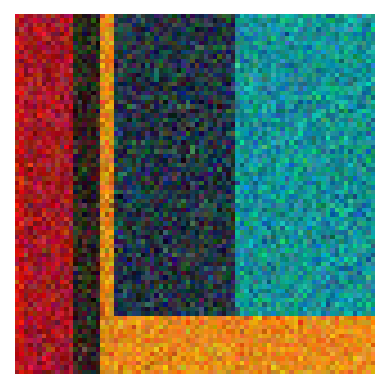

### Algorithimic-art generator

- Inspired by the excellent [Danielle Navarro](https://blog.djnavarro.net/posts/2024-12-23_art-from-code-6/), mostly a python port of the same concept.
- Check the notebook for some ideas.
- TO-DO:
  - Truchet tiles
